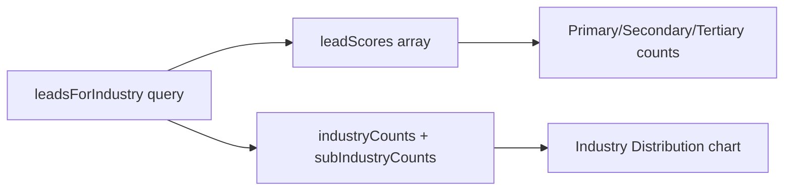

# Connection Degree Filter - Implementation Plan

## Requirement

When the user clicks any connection degree card (1st, 2nd, or 3rd), the entire dashboard must filter to show **only leads in that connection degree**. This includes:

- **Primary, Secondary, Tertiary** (lead quality breakdown)
- **Lead Metrics** (total leads, quality bar)
- **Industry Distribution** (pie chart, sub-industries)
- **Connection Type cards** (when filtered, only the selected degree shows non-zero)
- **Campaign Analytics** (messages, replies, engagement, campaign types)
- **Extraction this period**

---

## How Primary/Secondary/Tertiary Get Filtered

The key data flow:




**Primary, secondary, and tertiary are computed from `leadsForIndustry.rows**` in [backend/src/controllers/analytics.controller.js](backend/src/controllers/analytics.controller.js):

- Each row is scored (lines 136–199)
- `leadScores` is sorted; top 20% = primary, next 30% = secondary, rest = tertiary (lines 202–225)

Therefore: **filtering the `leadsForIndustry` query by `connection_degree` automatically filters primary, secondary, tertiary, and industry distribution** to the selected degree.

---

## Implementation Steps

### 1. Backend: [analytics.controller.js](backend/src/controllers/analytics.controller.js)

Add a whitelisted `connection_degree` SQL filter and apply it to all relevant queries:

**A. Add helper and read query param (after line 72):**

```javascript
function getConnectionDegreeClause(columnPrefix = '') {
  return (degree) => {
    const d = (degree || '').trim().toLowerCase();
    const col = columnPrefix ? `${columnPrefix}.connection_degree` : 'connection_degree';
    if (d === '1st' || d === '1') return ` AND (${col} ILIKE '%1st%' OR LOWER(TRIM(${col})) = '1')`;
    if (d === '2nd' || d === '2') return ` AND (${col} ILIKE '%2nd%' OR LOWER(TRIM(${col})) = '2')`;
    if (d === '3rd' || d === '3') return ` AND (${col} ILIKE '%3rd%' OR LOWER(TRIM(${col})) = '3')`;
    return '';
  };
}
```

- Read `connection_degree` from `req.query`
- Build `connFilter = getConnectionDegreeClause()(connection_degree)` for leads table
- Build `connFilterLeads = getConnectionDegreeClause('l')(connection_degree)` for JOINs with `leads` as `l`

**B. Append `connFilter` to all lead queries:**

- `totalLeads`, `sourceBreakdown`, `withPhone`, `withEmail`, `actionableLeads`
- `**leadsForIndustry**` (this drives primary/secondary/tertiary and industry distribution)
- `extractionByPeriod`, `connectionBreakdownResult`

**C. Campaign analytics:** When `connFilterLeads` is set, add `campaignLeadFilter` so only campaigns with leads in that degree are included. For `messagesSentResult`, `repliesResult`, `campaignLeadsByPeriod`, `messagesSentByPeriod`: JOIN `campaign_leads` to `leads` and apply `connFilterLeads`.

---

### 2. Frontend: [DashboardPage.jsx](frontend/src/pages/DashboardPage.jsx)

**A. State and fetch:**

- Add `selectedConnectionDegree` state (null | '1st' | '2nd' | '3rd')
- In `fetchAnalytics`, append `connection_degree` to the URL when set
- Include `selectedConnectionDegree` in the `useEffect` that calls `fetchAnalytics`

**B. Connection degree cards (lines 721–762):**

- Replace `onClick={() => navigate(...)}` with `onClick={() => toggleConnectionDegreeFilter('1st')}` (and 2nd, 3rd)
- Add toggle handler: if same degree clicked, clear filter; else set filter
- Apply selected styling when `selectedConnectionDegree === '1st'` (and 2nd, 3rd)

**C. Filter UX:**

- Show "Clear filter" button when a degree is selected
- Show header badge "Filtered by X degree" when active
- Pass `connection_degree` in CTAs ("Leads", "View in Leads List") when filter is active

---

## Verification

After implementation, when the user clicks "1st degree":

- Primary/secondary/tertiary counts reflect only 1st-degree leads
- Industry distribution shows only 1st-degree leads
- Total leads, extraction count, and campaign metrics are all scoped to 1st-degree leads
- Connection type cards show 1st: N, 2nd: 0, 3rd: 0 (when filtered by 1st)

